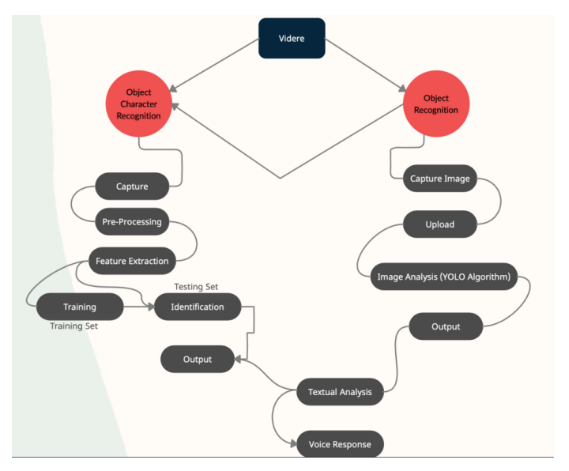
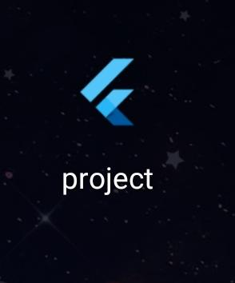
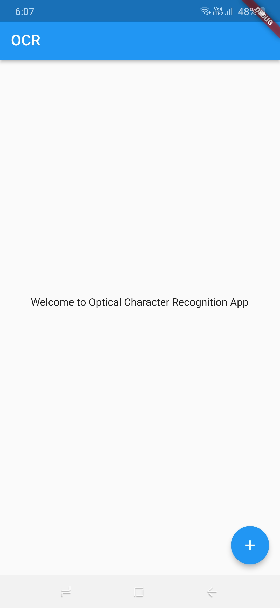
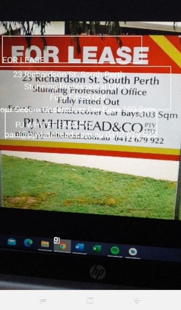
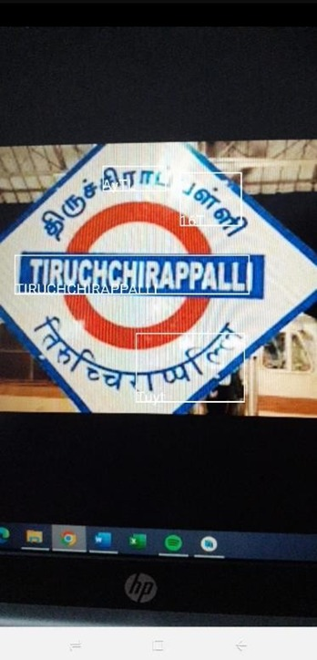
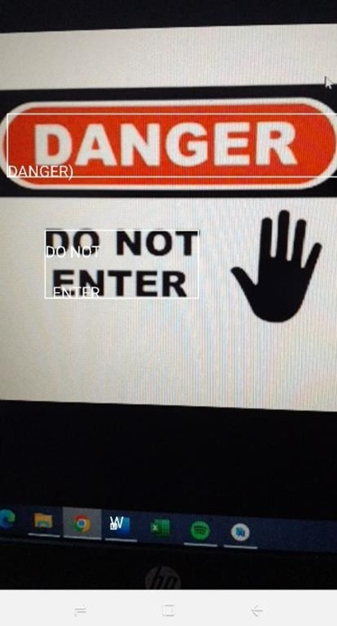
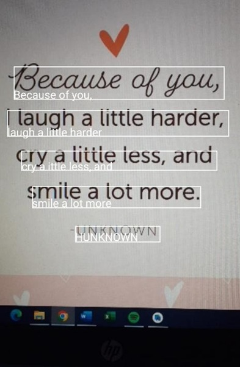

# **OPTICAL CHARACTER RECOGNITION APP**
---
## - **TEAM MEMBERS**
---
* `MOHAMED ABDUL AZHARUDDIN A (20BEE1179)`
### _**Contribution**_: Flutter mobile vision, flutter text to speech, flutter setup, code debugging.

* `RAKESH K (20BEE1177)`
### _**Contribution**_: Flutter application setup, Flutter application build, libraries for character recognition, code debugging, documentation.

* `KODIPYAKA VENKATESH (20BEC1346)`
### _**Contribution**_: Flutter application build, dart setup, code debugging, working of app.

---
## - **ABSTRACT**
---
### From reading a book to walking down the street, visually impaired people face numerous hurdles in their daily lives. Vision being the most important ability of humans, plays a crucial role and tends to increase the probability of dangerous situations and they require assistance in order to continue working on a daily basis. Visual impairments have become one of the most predominant problems for the last few decades. To keep doing their daily tasks, vision-impaired people usually seek help from others. Our team strives to use the versatility of smartphones and design an application that allows them to perform various actions through their phones effortlessly. Because of a lack of ocular vision, the person is unable to recognize or feel his or her environment. The main goal of this project is to give a way for visually impaired persons to gaze around.

---
## - **FEATURES**
---
### Today images and videos are everywhere. In fact, the sheer quantity of images on social media and networking sites is unfathomable. Every device is now fitted with a camera. This opens up huge possibilities. Object Recognition is a process of detecting an object and identifying it using various image algorithms. The main purpose is to recognize objects in real time and allot the objects to the classes that are previously defined and produce a voice output of the recognized object. Optical character recognition systems provide persons who are blind or visually impaired with the capacity to scan printed text and then have it spoken in synthetic speech. Here, the main purpose is to recognize the text which is scanned and produce voice output of the recognized text. 

---
## - **APPLICATIONS**
---
* ### The optical character recognition allows users to access text that is on signs, handouts, mail and other documents. One of the other serious issues, that are being faced by the visually impaired, is to recognize currency because of the likeness of paper surface and size among various classes. At the same time, visually impaired people are facing serious issues with newly released notes’ sizes and colors. So, it will be difficult for persons with low vision to identify and make appropriate transactions. Optical character recognition helps to identify the currency they could recognize bus name, railway stations, public sign boards, washrooms etc. 
* ### The most noteworthy part is when they explore a new place, they should understand the barriers’ position and other objects in their course for their safe navigation. Secure and safe mobility is one of the most demanding events faced by vision-impaired people in the real-life environment. Being unable to track out and avoid blockage in their course, so they need assistance from others or assistive devices to complete their day-to-day tasks including uninterrupted navigation and so on. So, object detection helps them to identify, recognize the objects and produce a voice output so that the person is aware of the object.

---
## - **APP CHARACTERISTICS**
---
### Our app consists of two divisions:
* ### **Optical character recognition**
* ### **Object recognition**
### These two characteristics are combined in an android application and is processed with a voice output.

---
## - **APP SCREENSHOTS**
---
### `ICON`

### `APP`

---
## - **OUTPUT SCREENSHOTS**
---
### `OUTPUT 1`

### `OUTPUT 2`

### `OUTPUT 3`

### `OUTPUT 4`

---
## - **VIDEO OF APP WORKING**
---
### `VIDEO DRIVE LINK`
## **(https://drive.google.com/file/d/1CDkHtSbLE8yxANaK2PHMD41m5JYQbX8a/view?usp=sharing)**

---
## - **OUR APP DEVELOPMENT JOURNEY**
---
### Optical Character Recognition (OCR) is one of the ways to connect real time vision and access information from it. However, it is extremely challenging to achieve high accuracy with real-time vision and cost factors. Flutter mobile vision is the dependency available in applications developed using flutter and dart plugins. Flutter mobile vision imports the Google cloud vision with the ML kit with functions compatible with android and iOS application development. The stages of OCR detection are: Text Detection, Direction Identification, Script Identification, Text Recognition, Layout Analysis. Flutter text-to-speech is the function available for giving voice commands for android/iOS application development. YOLO algorithm works using the following three techniques: Residual blocks, Bounding box regression, Intersection Over Union (IOU). The above – mentioned dependencies are added in the pubspec.yaml file to be imported to the current flutter project and the import package links from flutter are added as headers in the main.dart file which defines the functionality of all the components in the app. Additionally flutter requires the build.gradle file which is created automatically in which we have to connect to the ML kit in order to run the given dependencies with the application. YOLO algorithm provides improved detection results compared to other object detection techniques such as Fast R-CNN and RetinaNet. Our app has two modes: object recognition and character. Our app provides the utmost benefit for the persons who are blind or visually impaired. The character recognition enables the camera of our phone to take pictures of printed material, sign boards, advertisement banners, currency notes and so on. Then, it converts the captured images into text, and read the text aloud using high quality text-to-speech. We can infer that our app Videre is effective in helping persons who are blind or visually impaired and hence the applications of the bot: to help the person in identifying the object surrounding them and recognize any sort of text found in public places easily. The best part is that the app provides a voice activated output of captured image or text to the user in their regional language. As the application currently supports detection only with English, we could work with our knowledge about CNN to train a dataset of regional language words and detect them with our application. The structure of the application can be improved to be more accessible and completely voice activated. This project made us to gain insight on the Convolutional Neural Network and the steps of its working to provide detection and classification for image processing and machine vision. We have gained an overview of object detection and the YOLO algorithm. We have gone through the main reasons why the YOLO algorithm is important. We have learned how the YOLO algorithm works. We have also gained an understanding of the main techniques used by YOLO to detect objects. The API to build a voice assistant were understood and worked on the application. We have learned the real-life applications of YOLO. We were able to successfully implement the CNN network and voice assistant in the application with the knowledge on flutter, dart and java to develop the android application.

